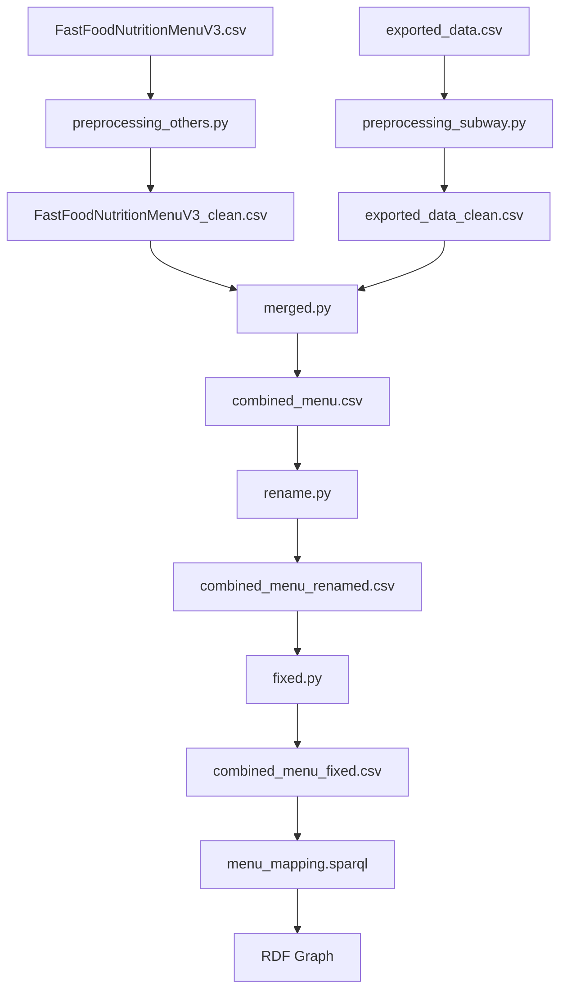

# Proyecto: Menú de Comida Rápida

## Preparación para RDF

Esta parte procesa menús de comida rápida de múltiples cadenas, limpia y combina los datos, y genera un grafo RDF listo para análisis semántico.

---

Archivos CSV originales:

FastFoodNutritionMenuV3.csv

exported_data.csv (Subway)

### Limpieza de CSV
#### Limpieza general (preprocessing_others.py)
Esta etapa:

Elimina símbolos de marca registrada (®, ™, ℠, ©) de todos los campos de texto.

Quita columnas innecesarias (Weight Watchers Pnts, Calories from Fat).

Guarda un CSV limpio: FastFoodNutritionMenuV3_clean.csv.

Ejecución:

```bash
python3 preprocessing_others.py
```
#### Limpieza específica para Subway (preprocessing_subway.py)
Esta etapa:

Limpia símbolos de marca registrada.

Añade columna Company = 'Subway'.

Quita columnas innecesarias de vitaminas y tamaño de porción.

Renombra columnas específicas:

Carbohydrates (g) → Carbs (g)

Dietary Fiber (g) → Fiber (g)

Guarda CSV limpio: exported_data_clean.csv.

Ejecución:

```bash
python3 preprocessing_subway.py
```
#### Combinación de CSV (merged.py)
Esta etapa:

Antes de la mezcla se añade una columna llamada "Category" que indica el tipo de plato, esta fue agregada manualmente mediante asistencia de IA.

Combina los CSV limpios (FastFoodNutritionMenuV3_clean.csv y exported_data_clean.csv).

Normaliza nombres de columnas.

Rellena valores nulos con 0 en columnas numéricas solo para filas donde la categoría sea drink.

Guarda el CSV combinado: combined_menu.csv.

Ejecución:

```bash
python3 merged.py
```
### Preparación para RDF
#### Limpieza de nombres y columnas (rename.py)
Esta etapa:

Limpia nombres de compañías para que sean compatibles con RDF/URI (por ejemplo, McDonald's → McDonalds).

Renombra columnas numéricas para que sean URI-friendly.

CSV listo para RDF: combined_menu_renamed.csv.

Ejecución:

```bash
python3 rename.py
```
#### Ajuste final de columnas (fixed.py)

Esta etapa:

Renombra columnas numéricas para mayor consistencia.

CSV final para RDF: combined_menu_fixed.csv.

Ejecución:

```bash
python3 fixed.py
```
### Generación de RDF (menu_mapping.sparql)
Esta etapa:

Cada fila se convierte en un ex:MenuItem.

Las compañías se mapean a IRIs de DBpedia conocidas:

Nombre CSV	IRI DBpedia
McDonalds	http://dbpedia.org/resource/McDonald's

Burger_King	http://dbpedia.org/resource/Burger_King

Pizza_Hut	http://dbpedia.org/resource/Pizza_Hut

KFC	http://dbpedia.org/resource/KFC

Taco_Bell	http://dbpedia.org/resource/Taco_Bell

Wendys	http://dbpedia.org/resource/The_Wendy's_Company

Subway	http://dbpedia.org/resource/Subway_(restaurant)

Los ítems desconocidos se asignan a <http://example.com/menu#UnknownCompany>.

Ejecución:
Asumiendo que está en el directorio donde se encuentra tarql.

```bash
\tarql-1.2\bin\tarql.bat menu_mapping.sparql combined_menu_fixed.csv > combined_menu.ttl
```
Lo anterior exporta un RDF en Turtle.



